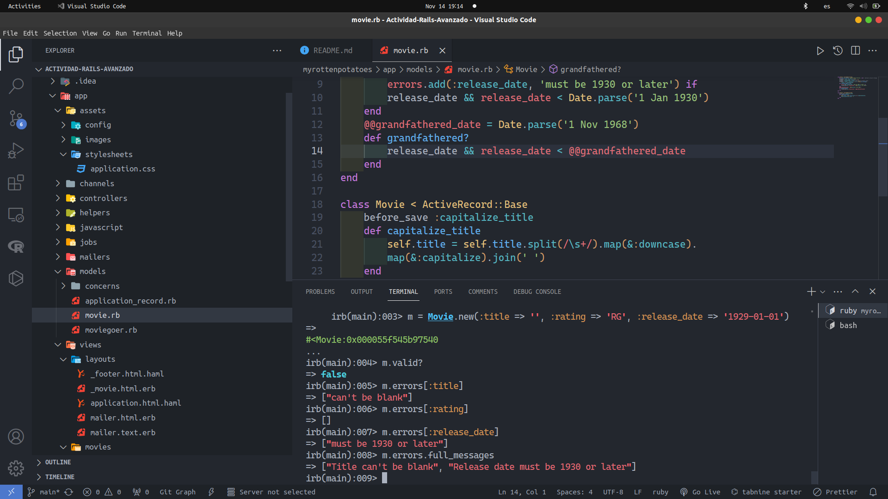
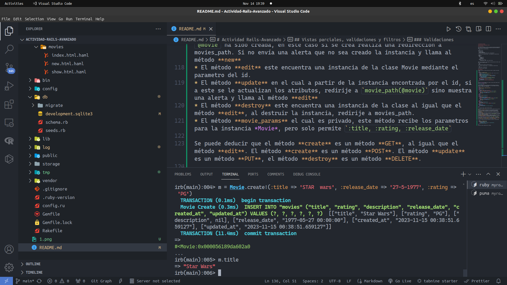

# Actividad Rails-Avanzado

## Vistas parciales, validaciones y filtros

### Vistas Parciales

En el texto de la actividad, se muestra el uso de una vista parcial usando html.erb en la vista index. Para este caso en el que nuestras vistas son del formato html.haml
La vista parcial será _movie.html.haml 

```haml
# _movie.html.haml
%tr
  %td= movie.title
  %td= movie.rating
  %td= movie.release_date
  %td= link_to "More about #{movie.title}", movie_path(movie)
```
Su ubicación fue en /app/views/layouts . Para implementarlo en index.html.haml

```haml
%table#movies
  %thead
    %tr
      %th Movie Title
      %th Rating
      %th Release Date
      %th More Info
  %tbody
    - @movies.each do |movie|
      = render partial: 'movie', locals: {movie: movie}
```

Además de esa vista parcial, se ha añadido una vista parcial para el footer, ya que esta se usará en todas las vistas.

```haml
%footer
  %p Current Date: "#{Time.now.strftime('%Y-%m-%d')}"
```
En el directorio /app/views/layouts. Y lo implementamos en index.html.haml

```haml
= render partial: 'layouts/footer'
```
Así mismo en las vistas restantes.

### Validaciones

Al modelo de Movie se le definen métodos para validar los campos de cada objeto creado.

```ruby
class Movie < ActiveRecord::Base
    def self.all_ratings ; %w[G PG PG-13 R NC-17] ; end #  shortcut: array of strings
    validates :title, :presence => true
    validates :release_date, :presence => true
    validate :released_1930_or_later # uses custom validator below
    validates :rating, :inclusion => {:in => Movie.all_ratings},
        :unless => :grandfathered?
    def released_1930_or_later
        errors.add(:release_date, 'must be 1930 or later') if
        release_date && release_date < Date.parse('1 Jan 1930')
    end
    @@grandfathered_date = Date.parse('1 Nov 1968')
    def grandfathered?
        release_date && release_date < @@grandfathered_date
    end
end
```

Usando *rails console* podemos crear un objeto y verificar dichos métodos como se puede ver en la siguiente imagen.



Se creo un objeto de la clase película con un título en blanco, una fecha de estreno muy antigua. Por lo que este objeto no es válido, podemos ver que tiene errores en el campo title y release_date.

```ruby
class MoviesController < ApplicationController
  def new
    @movie = Movie.new
  end 
  def create
    if (@movie = Movie.create(movie_params))
      redirect_to movies_path, :notice => "#{@movie.title} created."
    else
      flash[:alert] = "Movie #{@movie.title} could not be created: " +
        @movie.errors.full_messages.join(",")
      render 'new'
    end
  end
  def edit
    @movie = Movie.find params[:id]
  end
  def update
    @movie = Movie.find params[:id]
    if (@movie.update_attributes(movie_params))
      redirect_to movie_path(@movie), :notice => "#{@movie.title} updated."
    else
      flash[:alert] = "#{@movie.title} could not be updated: " +
        @movie.errors.full_messages.join(",")
      render 'edit'
    end
  end
  def destroy
    @movie = Movie.find(params[:id])
    @movie.destroy
    redirect_to movies_path, :notice => "#{@movie.title} deleted."
  end
  private
  def movie_params
    params.require(:movie)
    params[:movie].permit(:title,:rating,:release_date)
  end
end
```
El controlador de Movie, tenemos diferentes métodos.

* El primero el método **new** con el cual se crea un instancia vacía de la clase Movie. 
* El método **create** es el método por el cual se verifica si la instancia `@movie` ha sido creada, en este caso si se crea realiza una redirección a movies_path. Si no envía una alerta que no sea creado la instancia y llama al método **new**
* El método **edit** este encuentra una instancia de la clase Movie mediante el parametro del id.
* El método **update** en el cual a partir de la instancia encontrada por el id, si a este se le actualizan los atributos, redirije a `movie_path(@movie)` sino muestra una alerta y llama al método **edit**
* El método **destroy** este encuentra una instancia de la clase al igual que el método **edit**, al destruir la instancia, redirije a movies_path.
* El método **movie_params** el cual es privado, este método recibe los parametros para la instancia *Movie*, pero solo permite `:title, :rating, :release_date`

Se puede deducir que el método **create** es un método **GET**, al igual que el método **edit**. El método **create** es un método **POST**. El método **update** es un método **PUT**, el método **destroy** es un método **DELETE**.

Se tiene el siguiente método antes de guardar una instancia a la base de datos.

```ruby
class Movie < ActiveRecord::Base
    before_save :capitalize_title
    def capitalize_title
        self.title = self.title.split(/\s+/).map(&:downcase).
        map(&:capitalize).join(' ')
    end
end
```
Usando rails console, podemos mostrar un ejemplo. 



```ruby
self.title = self.title.split(/\s+/).map(&:downcase).
        map(&:capitalize).join(' ')
```
El título cambia, separa cada palabra por el espacio, lo convierte a minusculas cada palabra y luego al primer caracter lo convierte a mayusculas, por eso que se ingreso como title : "STAR wars" y al imprimir el title mostró "Star Wars".

### Filtros

```ruby
class ApplicationController < ActionController::Base
    before_action :set_current_user  # change before_filter
    protected # prevents method from being invoked by a route
    def set_current_user
        # we exploit the fact that the below query may return nil
        @current_user ||= Moviegoer.where(:id => session[:user_id])
        redirect_to login_path and return unless @current_user
    end
end
```

El método `set_current_user` verifica si existe un determinado usuario en la tabla Moviegoer. Sin embargo al desplegarlo localmente, no se puede encontrar dicha tabla **Could not find table 'moviegoers'**.

#### SSO y autenticación a través de terceros

Creamos una migración y un modelo para Moviegoer con el comando `rails generate model Moviegoer name:string provider:string uid:string` y luego `rails db:migrate` para crear la migración.

Usaremos la gema 'OmniAuth' para realizar autenticaciones usando una API. `gem 'omniauth'` además de la gema omniauth-twitter `gem 'omniauth-twitter'`

**Pregunta**: Debes tener cuidado para evitar crear una vulnerabilidad de seguridad. ¿Qué sucede si un atacante malintencionado crea un envío de formulario que intenta modificar params[:moviegoer][:uid] o params[:moviegoer][:provider] (campos que solo deben modificarse mediante la lógica de autenticación) publicando campos de formulario ocultos denominados params[moviegoer][uid] y así sucesivamente?.

El atacante podria enviar datos maliciosos, datos no deseados y podría causar vulnerabilidades al sistema de autenticación lo cual podría hacer que permita usuarios no con buenas intenciones a cambiar contenido de nuestra aplicación de forma indebida. Para solucionar esto, al investigar, se puede usar *Strong Parameters*, *Validaciones adicionales*.

#### Claves Foraneas


