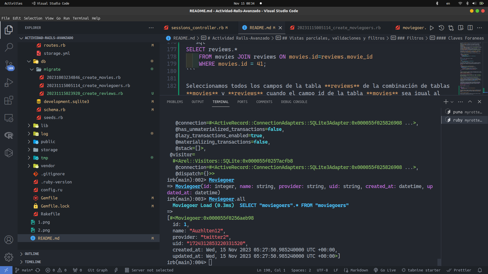

# Actividad Rails-Avanzado

## Vistas parciales, validaciones y filtros

### Vistas Parciales

En el texto de la actividad, se muestra el uso de una vista parcial usando html.erb en la vista index. Para este caso en el que nuestras vistas son del formato html.haml
La vista parcial será _movie.html.haml 

```haml
# _movie.html.haml
%tr
  %td= movie.title
  %td= movie.rating
  %td= movie.release_date
  %td= link_to "More about #{movie.title}", movie_path(movie)
```
Su ubicación fue en /app/views/layouts . Para implementarlo en index.html.haml

```haml
%table#movies
  %thead
    %tr
      %th Movie Title
      %th Rating
      %th Release Date
      %th More Info
  %tbody
    - @movies.each do |movie|
      = render partial: 'movie', locals: {movie: movie}
```

Además de esa vista parcial, se ha añadido una vista parcial para el footer, ya que esta se usará en todas las vistas.

```haml
%footer
  %p Current Date: "#{Time.now.strftime('%Y-%m-%d')}"
```
En el directorio /app/views/layouts. Y lo implementamos en index.html.haml

```haml
= render partial: 'layouts/footer'
```
Así mismo en las vistas restantes.

### Validaciones

Al modelo de Movie se le definen métodos para validar los campos de cada objeto creado.

```ruby
class Movie < ActiveRecord::Base
    def self.all_ratings ; %w[G PG PG-13 R NC-17] ; end #  shortcut: array of strings
    validates :title, :presence => true
    validates :release_date, :presence => true
    validate :released_1930_or_later # uses custom validator below
    validates :rating, :inclusion => {:in => Movie.all_ratings},
        :unless => :grandfathered?
    def released_1930_or_later
        errors.add(:release_date, 'must be 1930 or later') if
        release_date && release_date < Date.parse('1 Jan 1930')
    end
    @@grandfathered_date = Date.parse('1 Nov 1968')
    def grandfathered?
        release_date && release_date < @@grandfathered_date
    end
end
```

Usando *rails console* podemos crear un objeto y verificar dichos métodos como se puede ver en la siguiente imagen.


Se creo un objeto de la clase película con un título en blanco, una fecha de estreno muy antigua. Por lo que este objeto no es válido, podemos ver que tiene errores en el campo title y release_date.

```ruby
class MoviesController < ApplicationController
  def new
    @movie = Movie.new
  end 
  def create
    if (@movie = Movie.create(movie_params))
      redirect_to movies_path, :notice => "#{@movie.title} created."
    else
      flash[:alert] = "Movie #{@movie.title} could not be created: " +
        @movie.errors.full_messages.join(",")
      render 'new'
    end
  end
  def edit
    @movie = Movie.find params[:id]
  end
  def update
    @movie = Movie.find params[:id]
    if (@movie.update_attributes(movie_params))
      redirect_to movie_path(@movie), :notice => "#{@movie.title} updated."
    else
      flash[:alert] = "#{@movie.title} could not be updated: " +
        @movie.errors.full_messages.join(",")
      render 'edit'
    end
  end
  def destroy
    @movie = Movie.find(params[:id])
    @movie.destroy
    redirect_to movies_path, :notice => "#{@movie.title} deleted."
  end
  private
  def movie_params
    params.require(:movie)
    params[:movie].permit(:title,:rating,:release_date)
  end
end
```
El controlador de Movie, tenemos diferentes métodos.

* El primero el método **new** con el cual se crea un instancia vacía de la clase Movie. 
* El método **create** es el método por el cual se verifica si la instancia `@movie` ha sido creada, en este caso si se crea realiza una redirección a movies_path. Si no envía una alerta que no sea creado la instancia y llama al método **new**
* El método **edit** este encuentra una instancia de la clase Movie mediante el parametro del id.
* El método **update** en el cual a partir de la instancia encontrada por el id, si a este se le actualizan los atributos, redirije a `movie_path(@movie)` sino muestra una alerta y llama al método **edit**
* El método **destroy** este encuentra una instancia de la clase al igual que el método **edit**, al destruir la instancia, redirije a movies_path.
* El método **movie_params** el cual es privado, este método recibe los parametros para la instancia *Movie*, pero solo permite `:title, :rating, :release_date`

Se puede deducir que el método **create** es un método **GET**, al igual que el método **edit**. El método **create** es un método **POST**. El método **update** es un método **PUT**, el método **destroy** es un método **DELETE**.

Se tiene el siguiente método antes de guardar una instancia a la base de datos.

```ruby
class Movie < ActiveRecord::Base
    before_save :capitalize_title
    def capitalize_title
        self.title = self.title.split(/\s+/).map(&:downcase).
        map(&:capitalize).join(' ')
    end
end
```
Usando rails console, podemos mostrar un ejemplo. 


```ruby
self.title = self.title.split(/\s+/).map(&:downcase).
        map(&:capitalize).join(' ')
```
El título cambia, separa cada palabra por el espacio, lo convierte a minusculas cada palabra y luego al primer caracter lo convierte a mayusculas, por eso que se ingreso como title : "STAR wars" y al imprimir el title mostró "Star Wars".

### Filtros

```ruby
class ApplicationController < ActionController::Base
    before_action :set_current_user  # change before_filter
    protected # prevents method from being invoked by a route
    def set_current_user
        # we exploit the fact that the below query may return nil
        @current_user ||= Moviegoer.where(:id => session[:user_id])
        redirect_to login_path and return unless @current_user
    end
end
```

El método `set_current_user` verifica si existe un determinado usuario en la tabla Moviegoer. Sin embargo al desplegarlo localmente, no se puede encontrar dicha tabla **Could not find table 'moviegoers'**.

#### SSO y autenticación a través de terceros

Creamos una migración y un modelo para Moviegoer con el comando `rails generate model Moviegoer name:string provider:string uid:string` y luego `rails db:migrate` para crear la migración.

Usaremos la gema 'OmniAuth' para realizar autenticaciones usando una API. `gem 'omniauth'` además de la gema omniauth-twitter `gem 'omniauth-twitter'`

**Pregunta**: Debes tener cuidado para evitar crear una vulnerabilidad de seguridad. ¿Qué sucede si un atacante malintencionado crea un envío de formulario que intenta modificar params[:moviegoer][:uid] o params[:moviegoer][:provider] (campos que solo deben modificarse mediante la lógica de autenticación) publicando campos de formulario ocultos denominados params[moviegoer][uid] y así sucesivamente?.

El atacante podria enviar datos maliciosos, datos no deseados y podría causar vulnerabilidades al sistema de autenticación lo cual podría hacer que permita usuarios no con buenas intenciones a cambiar contenido de nuestra aplicación de forma indebida. Para solucionar esto, al investigar, se puede usar *Strong Parameters*, *Validaciones adicionales*.

Logramos autenticarnos usando el API de Twitter




#### Claves Foraneas

Explica la siguientes líneas de SQL:

```sql
SELECT reviews.*
    FROM movies JOIN reviews ON movies.id=reviews.movie_id
    WHERE movies.id = 41;
```

Seleccionamos todos los campos de la tabla **reviews** de la combinación de tablas **movies** y **reviews** cuando el campo id de la tabla **movies** sea igual al campo movie_id de la tabla **reviews**, donde el campo id de la tabla **movies** sea 41.

**¿Por que se puede hacer esto?**

Porque en las tablas relacionales se puede usar la sentencia JOIN para combinar tablas basandose en campos comunes entre las tablas.

En la consola de rails tenemos los siguientes resultados

```ruby
irb(main):004> inception = Movie.find_by(title: 'Inception')
  Movie Load (0.2ms)  SELECT "movies".* FROM "movies" WHERE "movies"."title" = ? LIMIT ?  [["title", "Inception"], ["LIMIT", 1]]
=> 
#<Movie:0x000055ef3ed7f9f0
...
irb(main):005> yo = Moviegoer.find(1)
  Moviegoer Load (0.4ms)  SELECT "moviegoers".* FROM "moviegoers" WHERE "moviegoers"."id" = ? LIMIT ?  [["id", 1], ["LIMIT", 1]]
=> 
#<Moviegoer:0x000055ef3efcd5e0
...
irb(main):006> me_review = Review.new(potatoes: 5)
=> #<Review:0x00007fbe4050d768 id: nil, potatoes: 5, comments: nil, moviegoer_id: nil, movie_id: nil, created_at: nil, updated_at: nil>
irb(main):007> inception.reviews << me_review
=> nil
irb(main):008> inception.reviews
  Review Load (0.5ms)  SELECT "reviews".* FROM "reviews" WHERE "reviews"."movie_id" = ?  [["movie_id", 33]]
=> [#<Review:0x00007fbe4050d768 id: nil, potatoes: 5, comments: nil, moviegoer_id: nil, movie_id: 33, created_at: nil, updated_at: nil>]
irb(main):010> yo.reviews << me_review
  TRANSACTION (0.2ms)  begin transaction
  Review Create (1.2ms)  INSERT INTO "reviews" ("potatoes", "comments", "moviegoer_id", "movie_id", "created_at", "updated_at") VALUES (?, ?, ?, ?, ?, ?)  [["potatoes", 5], ["comments", nil], ["moviegoer_id", 1], ["movie_id", 33], ["created_at", "2023-11-15 05:53:18.532363"], ["updated_at", "2023-11-15 05:53:18.532363"]]
  TRANSACTION (12.9ms)  commit transaction
  Review Load (0.4ms)  SELECT "reviews".* FROM "reviews" WHERE "reviews"."moviegoer_id" = ?  [["moviegoer_id", 1]]
=> 
[#<Review:0x00007fbe4050d768
  id: 1,
  potatoes: 5,
  comments: nil,
  moviegoer_id: 1,
  movie_id: 33,
  created_at: Wed, 15 Nov 2023 05:53:18.532363000 UTC +00:00,
  updated_at: Wed, 15 Nov 2023 05:53:18.532363000 UTC +00:00>]
irb(main):011> inception.reviews.map { |r| r.moviegoer.name }
=> ["Auzhlten12"]
```

#### Asociaciones Indirectas

**¿Qué indica el siguiente código SQL ?**

```sql
SELECT movies .*
    FROM movies JOIN reviews ON movies.id = reviews.movie_id
    JOIN moviegoers ON moviegoers.id = reviews.moviegoer_id
    WHERE moviegoers.id = 1;
```

Este codigo SQL recupera todos los campos de la tabla movies desde la combinacion de la tabla movies con reviews tal que el campo id de movies sea igual al campo movie_id de la tabla reviews, a esta combinacion se le combina la tabla moviegoers tal que el id de esta sea igual al moviegoers_id de la tabla reviews, y a toda esta tabla combinada se toma la fila tal que el id de moviegoers sea 1.

- Como llamar a save o save! sobre un objeto que usa asociaciones también afecta a los objetos a los que esté asociado, se aplican algunas salvedades si alguno de estos métodos falla. Por ejemplo, si acabas de crear una nueva Movie y dos nuevas Review que asociar a esa Movie`, e intenta guardar dicha película, cualquiera de los tres métodos save que se apliquen fallarán si los objetos no son válidos (entre otras razones). !Comprueba esto!.

```ruby 
irb(main):015> movie = Movie.new(title: "Inception")
=> #<Movie:0x000055bf20c960f0 id: nil, title: "Inception", rating: nil, description: nil, release_date: nil, created_at: nil, updated_at: nil>
irb(main):017> movie.reviews.build(:potatoes => 5)
=> #<Review:0x000055bf223e1d90 id: nil, potatoes: 5, comments: nil, moviegoer_id: nil, movie_id: nil, created_at: nil, updated_at: nil>
irb(main):018> movie.reviews.build(:potatoes => nil)
=> #<Review:0x000055bf225dd6a8 id: nil, potatoes: nil, comments: nil, moviegoer_id: nil, movie_id: nil, created_at: nil, updated_at: nil>
irb(main):019> movie.save
=> false
```
Podemos ver que la pelicula no se guarda en la base de datos. A pesar de que el review nil fue contruido.

- Existen opciones adicionales en los métodos de asociaciones que controlan lo que pasa a los objetos que son “tenidos” cuando el objeto “poseedor” se destruye. Por ejemplo, has_many :reviews,:dependent=>:destroy especifica que las críticas que pertenezcan a una determina película se deben borrar de la base de datos si se borra esa película.

```ruby
irb(main):013> movie = Movie.find_by(title: 'Inception')
  Movie Load (0.4ms)  SELECT "movies".* FROM "movies" WHERE "movies"."title" = ? LIMIT ?  [["title", "Inception"], ["LIMIT", 1]]
=> 
#<Movie:0x000055a033334d10
...
irb(main):014> review1 = Review.create(potatoes: 4, movie: movie)
=> 
#<Review:0x000055a033650418
...
irb(main):015> review2 = Review.create(potatoes: 5, movie: movie)
=> 
#<Review:0x000055a03228b0b8
...
irb(main):017> movie.reviews << review1
=> nil
irb(main):018> movie.reviews << review2
=> nil
irb(main):019> movie.reviews
  Review Load (0.4ms)  SELECT "reviews".* FROM "reviews" WHERE "reviews"."movie_id" = ?  [["movie_id", 34]]
=> 
[#<Review:0x000055a033650418
  id: nil,
  potatoes: 4,
  comments: nil,
  moviegoer_id: nil,
  movie_id: 34,
  created_at: nil,
  updated_at: nil>,
 #<Review:0x000055a03228b0b8
  id: nil,
  potatoes: 5,
  comments: nil,
  moviegoer_id: nil,
  movie_id: 34,
  created_at: nil,
  updated_at: nil>]
irb(main):022> movie.destroy
  TRANSACTION (0.1ms)  begin transaction
  Movie Destroy (0.3ms)  DELETE FROM "movies" WHERE "movies"."id" = ?  [["id", 34]]
  TRANSACTION (1.5ms)  commit transaction
=> 
#<Movie:0x000055a033334d10
 id: 34,
 title: "Inception",
 rating: "G",
 description: nil,
 release_date: Wed, 15 Nov 2023 00:00:00.000000000 UTC +00:00,
 created_at: Wed, 15 Nov 2023 06:41:07.483770000 UTC +00:00,
 updated_at: Wed, 15 Nov 2023 06:41:07.483770000 UTC +00:00>
irb(main):023> Review.count
  Review Count (0.4ms)  SELECT COUNT(*) FROM "reviews"
=> 0
irb(main):024> movie.reviews
=> []
```
Se creo una instacia de la clase de Movie, la cual se le agrego dos reviews, al ejecutar movie.reviews pudimos ver dos reviews las cuales habiamos creado.

Al eliminar la instancia, luego ejecutando movie.reviews resulto un array vacio, por lo que se eliminaron los reviews a esa pelicula.
